# Raspbery PI 5 Node Cluster Case

Gregor von Laszewski1, Eliyah Zayin2,
Diego Ansaldo2, Lori Hoevener2

* 1Indiana University, laszewski@gmail.com 
* 2The Academy of Science and Entrepreneurship, diegansaldo@gmail.com, eliyahzayin@gmail.com

This document is published in github at

* PDF: <https://github.com/cloudmesh-community/case/blob/master/vonLaszewski-pi-cluster-case.pdf>
* epub: <https://github.com/cloudmesh-community/case/blob/master/vonLaszewski-pi-cluster-case.epub?raw=true>

## Abstract

We present the design of a Raspberry Pi cluster case that allows to
create a cluster created form up to five Raspberry Pi's.  The cluster
is designed for educational purposes as part of a Cloud Engineering
class taught at Indiana University. The clusters are designed to be
portable and allow the integration into a *shelf* where multiple such
clusters can build a bigger cluster. Hence an individual five node
cluster can be taken home to support work there, but when coming to
class the cluster can be plugged into the shelf to allow sharing of
the Pi's among all class members.  The case is designed without need
of screws and can be reproduced on a laser cutter without purchasing
of additional components. All design files are openly distributed.

## Introduction

Raspberry PI's are inexpensive and in contrast to a compute server
that cost about $15K, one can get a fully operational PI for less than
$50.  Despite its low cost a number of PIs are an ideal platform for
developing prototype clusters to use for development of non-memory
intense cluster services. Naturally it does not have the same compute
or memory power as a number of $15K servers have, but to showcase some
of the software services and tools needed to build more expensive
clusters the PI platform is very useful. However, such a cluster does
not come with a case. One could purchase multiple cases, but such
cases assume external power and networking. Our goal is to create a
single case that can hold up to 5 Raspberry Pi's. Furthermore, We like
to be able to connect multiple such clusters to a larger cluster that
is housed in a shelf or rack.

We present here our current solution for such a case and also give
opportunities for further improvements to this effort which can be
conducted as part of educational activities including high school,
undergraduate, and graduate students that are interested in such
activities. Alternatives such as virtualizing a cluster entirely in a
cloud or on a user's local computer are discussed in [@las-cloud-eng]
and [@las-cloud-clusters-pi].

## Requirements

Next we list a number of requirements for this effort. We distinguish
educational requirements and technical requirements.

### Educational Requirements

We list a number of educational requirements that we addressed through
this effort

*Focus on Programming:* Typically students will use a graphical user
interface based tool to design such a case. However, from the
beginning on we wanted to avoid such a GUI based method and expose
students to programming. This is especially desirable in case students
need to not only be introduced in GUI design processes, but also
programming as this will lead to a more parameterized design as well
as exposing students to concepts of programming.

*Focus on Simplicity of the Design:* Certainly it is possible to
create a fairly complex design or a design inspired by art and
architecture. However, in our case we wanted to focus on a simple
design that could be integrated in a shelf. In future we hope that the
cases can be modified and for example get artful additions to for
example support efforts such as documented in [@Beesley13architecture]. 

*Iterative Design:* The activity was scheduled around the principle
of an iterative design process in which first principles such as
easy connectors were prototyped, before the whole case was designed.

*Alternative but Integrative Design:* The activity allowed for
alternative designs to be explored and each student member had the
opportunity to follow their own idea. Exchange of ideas in an open
environment was however encouraged and improvement suggestions need
to influence the design process. This is part of a strong team work
approach of the activities.

*Documentation:* The activity has a minimal documentation requirement
in which the design is documented so it can be reproduced and
sufficient assembly instructions are provided. As the Laser cutting
equipment use if very new, we want to make sure that enough
documentation is identified and added so that it can be used for other
students to reuse. 

*Advanced Documentation Requirements:* The activity allows also for
participation in advanced documentation requirements such as this
document that is also influenced by [@las-cloud-eng] and
[@las-cloud-clusters-pi]. As part of this requirement students have
the ability to participate in writing a paper instead of an experience
report. A paper focusses on how to write an academic paper, while an
experience report focusses more on what a student has done. We
identified that the later often leads to information that although
valuable for the student to recognize, does not communicate the effort
in a short an effective manner to the reader while focusing on the
deliverables.

*STEM Integration:* Demonstrate that STEM students can meaningful 
contribute to activities done at the University level.

### Technical Requirements

The following technical requirements exist

* Develop a case than can hold up to five PI's of Raspberry PI 3B or PI
  3B+, a network switch that can in addition be plugged into a laptop,
  and a power supply to power the Pi's.

* No screws or glue needs to be used to assemble the case

* Laser cut material is to be used for the case

* The design document is openly redistributable

* The design has been fully tested and an assembly has been conducted

* Assembly instructions are provided

* A materials ordering list is provided to print either 1 or 10 cases.

* The cases be integratabtle intoa shelf that can host many of the
  clusters with 10 being the minimal.

* Prepare integration of a cluster with 200+ Raspberry PI's

* Compare the design to that of other cluster cases for PI's

* Have the cases be stable enough so they can be carried in a bag
  between home and class without breaking them.

## Design of the Case

Based on these requirements we designing a Raspberry PI Case for five
PI's out of laser cut sheets with the goals of keeping the design as
simple as possible, using few parts as to minimize production costs,
allowing for easy assembly without screws or glue, while making it
structurally sound. Furthermore, we allow reproducibility through an
open source design.

Two major innovations were included into the design to address the
requirement of not using screws and glue:

1. a peg and slot system to easily lock in perpendicularly
2. an interlock system based on cutouts and rectangular wholes so the
   pieces  fit nicely.

Due to the iterative design process including the programmatic  design plans,
build, test, and analyze phase and its iteration The final design was
refined over time addressing issues that were discovered during the
actual assembly.

Although our design does not require it, we recommend to put some
strong rubber bands around the case before transporting it between
home and school as preventive measurement. Cushioning the case during
the transport in the bag for example with cloth material is not
needed, but is recommended just in case.

## Manufacturing Facilities

Our design is general enough so that it fits common laser cutters.  We
used two different cutters, both from Trotech. This includes the
Speedy 360 and the Speedy 400. The Speedy 360 has a 813x508mm bed
while the 400 has a 1000x610mm bed. Acrylic material on these laser
cutters can be cut up to 6mm. To ensure that the material will fit
into the laser cutter, ordered acrylic sheets are limited to the
dimensions of the bed minus a quarter inch. The laser cutter has an
influence on our layout of the design. If you have laser cutters with
a different bed size, please make appropriate modifications of the
layout of the parts for the case.

### Material

The laser cut parts utilize 3mm cut-to-size acrylic. Although thicker
material would be more stable, it is not as suitable as its weight is
more and it is also more expensive. Thus a decision has been made to
stick with the 3mm as it is lighter during the transport. It can be
purchased for ex ample from

* <https://www.tapplastics.com/product/plastics/cut_to_size_plastic>.

The acrylic material may either be cast or extruded. Choosing cast
acrylic will give a higher quality in color and engraving but it is
also more expensive.  A single case will need the following
dimensions:

* 21 3/16in x 15in

or in cm rounded up to the next cm

* 54cm x 39 cm

The cost for a single cluster would be based on material choices:

* Extruded Acrylic (Clear): $11.16
* Cast Acrylic (Clear): $16.41
* Cast Acrylic (Transparent Colors): $18.81

This is considerable cheaper than buying cases individually as they
typically are sold for about $10 a Pi but do not include the
encasement for the power and network equipment.

To build 10 cases that fit on the larger Trotech laser cutter we need
to order the following while using extruded acrylic:

---

{width=20px} Student will provide concreate order information

---

## SCAD Files

The design of the cases were conducted in SCAD.

SCAD [@www-scad] is a program that can creating 3D CAD models. It is
freely available for the common operating systems. The special aspect
about SCAD is that it is based on a programming language to develop
the model instead of a Graphics interface. This allows a programmatic
creation of the model and modification through its programming
language rather than a drag and drop interface.

The CAD files for the case are shard in SCAD and SVG format in the following location

* <https://github.com/cloudmesh-community/case/tree/master/design/scad>

We have two designs. One with a locking mechanism the other without.

To produce a physical copy of our prototypes, we could not simply use
the file in it's SCAD format. To ready the design for laser cutting,
we first have to export the file as a SVG. Once this is done, the file
can be edited in a graphic design program, such as Adobe Illustrator
[@www-adobe-illustrator] or Inkscape [@www-inkscape]. Edits required
to prepare the design include the removal of the interior fill color
of the case components and adjustment of the edges for cutting. The
laser cutter is preset to cut along red lines with a low
thickness. For the prototypes, we used a 0.03 point thickness.

---

{width=20px} At this time the description of how to identify a reference point
for scaling is not yet complete. This can be completed in one of two
ways.

1. Keep the SCAD files as they are, but make sure that a concrete
   description be added which feature can be used for scaling and how.

2. add a 1x1 cm or 1x1 inch square to the design which serves as
   reference point.

To avoid complex instructions the solution 2 seems overall easier.

---

The design must also be correctly scaled to the right size.
A 1x1 cm reference square is located on part A in the layout given
below in the assymby instructions.The correct scale factor can be calculated
by dividing the deired size of the square (10mm) by the length given in the
program. Select all objects and scale them by the resulting ratio.

Once all editing is done, the design can be cut. This can be done by
selecting the print option in the graphic design program and clicking
on settings, in Adobe Illustrator, this can be found in the lower left corner
of the main print window. If the laser cutter is not selected as the
printer, it will need to be selected. The dimensions in the print
settings will also need to be adjusted if they are smaller than the
size of the design; in Illustrator, the size can be changed under
preferences, which is located directly beneath the printer selection.
The settings window can now be closed and the *print* button on the
main print window can be selected. This will send the file to the
laser cutter as a job.

### Assembly Instructions

Once the case has been printed it needs to be assembled. The detailesd 
instructions are included in the Section [Case A](#sec:assembly).
Our assembly instructions include the instructions to
showcase the assembly of the case alone with pictures.

The placement of the components can be identified from pictures 
of our finished product including cables.

### Final Product

The final case without components is shown in +@fig:trans. 

{#fig:trans with=50%}

The final product looks as shown in +@fig:final. Cables are not added
in this image.

{#fig:final with=50%}

If cables are added the case looks as depicted in +@fig:cable.

{#fig:cable}

## Community Outreach

As part of this activity, we exhibited the Cluster at a local maker
fare called Makevention [@www-makevention]. During that exhibit we got
a lot of interest in the Pi cluster activities and the Cloud Computing
course [@las-cloud-eng] taught at Indiana University. An event picture
is shown in +@fig:makevention.

{#fig:makevention with=50%}

## Future work

Future Design Activities include the following activities. We are
looking for students that would like to take on these tasks and
contribute to this document.

**Cluster Shelf or Rack:** To accommodate  larger clusters in the class
setting a shelf is proposed in which we *place* the miniclusters while
attaching it through a power distribution bar and a large network
switch to integrate the individual clusters into the larger
cluster. Furthermore we want to create a product in a box called
*Cloudmesh Pi Cluster* that we can give to students so they can
assemble such a cluster themselves, or order the parts directly from us
and we ship the parts and the cluster case to them.

**Product Box:** It is useful to be able to distribute such a cluster
as a Kit, either distributed by us or others. For this we need to
design a shipping box that includes all parts of a five node cluster
including an online instruction manual and an artful product label.

**Bitscope Rack:** We have also access to a 19 inch rack based on:

* 19 inch rack for 40 nodes via bitscope, <https://www.festi.info/boxes.py/Rack19Box>

We like to create a rack that contains 5 such clusters holding all
together 200 Raspberry Pis.

**40 node case:** We like to design a 40 node case in 19 inch rack
format from laser cut material

**Dense joints**: we could design a future case with tighter joints in
mind such as projected by the following program that creates basic
boxes based on any dimension provided by the user.

* <https://www.festi.info/boxes.py/>

## Partners

This internship was conducted in partnership with the Academy of
Science and Entrepreneurship [@www-acadmey-high-school] is a public
high school located in Bloomington, Indiana, and part of the Monroe
County Community School Corporation.  Unlike other public high schools
in Monroe County, the Academy focuses almost exclusively on
high-quality project-based learning.  Classes are often co-taught and
subject matter integrated into one course. For example, sophomore
English and World History are combined into the Global Perspectives
course taken by all sophomore students and taught by two instructors.

The Academy strongly emphasizes authentic projects and *real world*
skills; therefore, student internships are strongly encouraged for all
upperclassmen. Each career exploration internship must be at least
forty hours in length, and students are required to complete a series
of reflections, in addition to receiving an evaluation by the
internship host.  Internships may be completed during the school year
and/or over summer break.  The Academy is also an early college high
school and has a strong partnership with Bloomington Ivy Tech, where
students may take up to five free dual credit classes.  It is through
all of these experiences that Academy graduates are uniquely prepared
for post-secondary success.  Additional information can be found at
the school web site:.

This project served also as prototype to identify opportunities for
local high schools to participate in educational activities at the
University, which it successfully demonstrated.

## Assembly Instructions {#sec:assembly}

### Case A - With lock

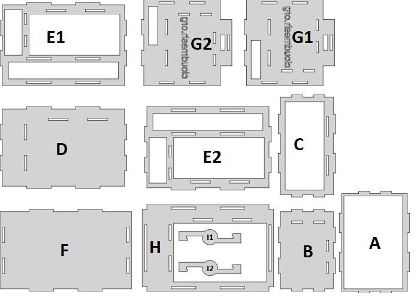

|     |     |
| --- | --- |
| 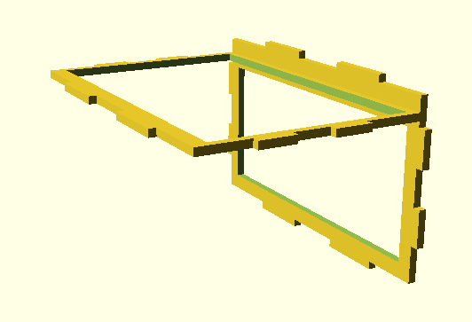{width=50%} | 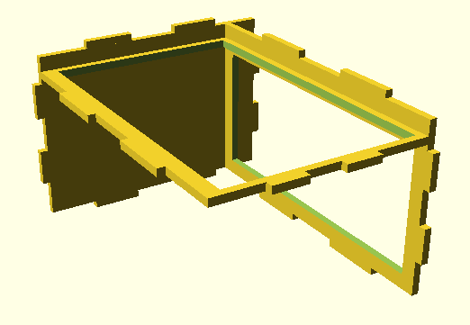{width=50%} |
| Add A and C |  Add B  |
|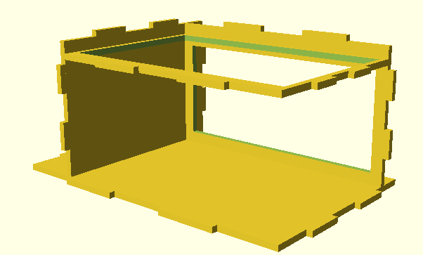{width=50%} | 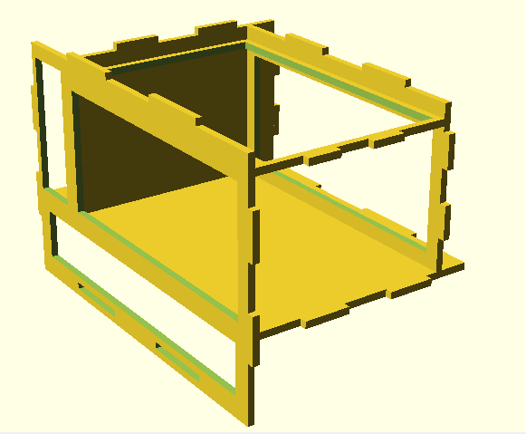{width=50%} |
| Add D |  Add E2   |
| 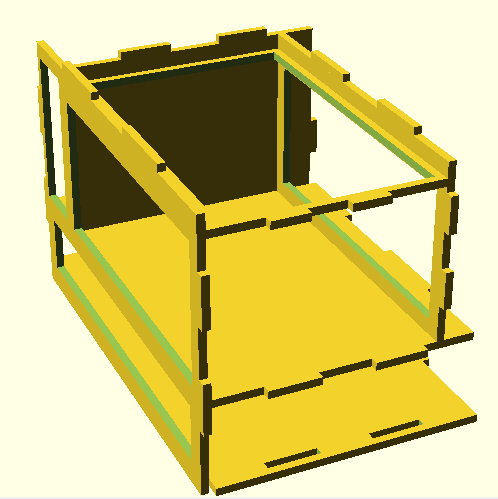{width=50%} | 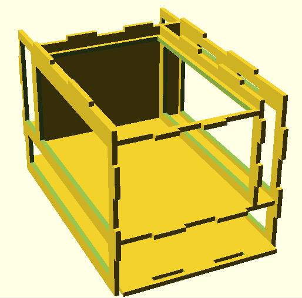{width=50%} |
|  Add F |  Add E1 |
| 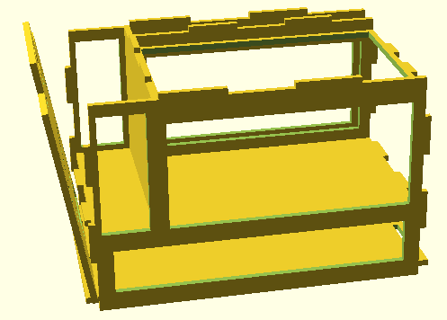{width=50%} | 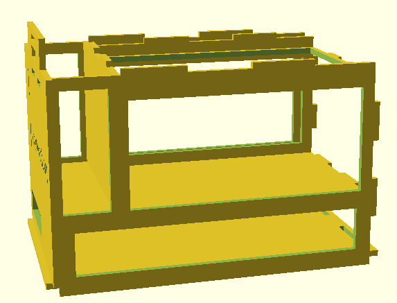{width=50%} |
|  Add G1  | Lock G1  |
| 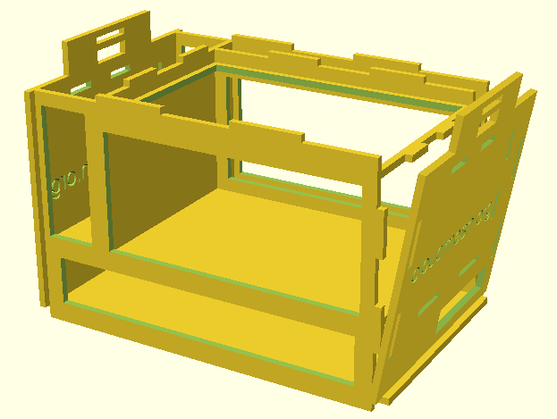{width=50%} | 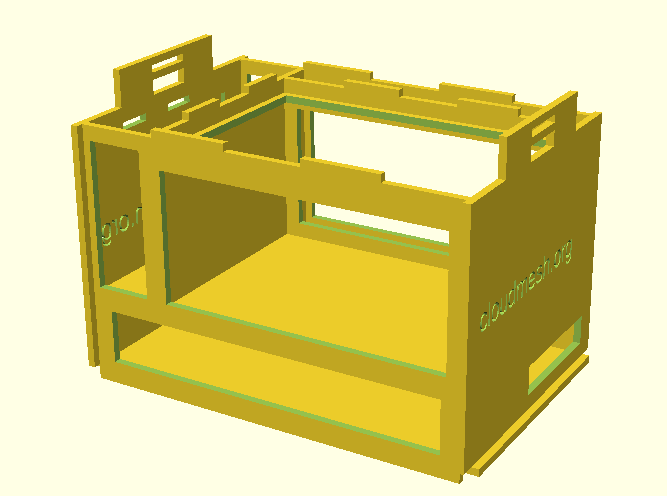{width=50%} |
|  Add G2  | Lock G2  |
| 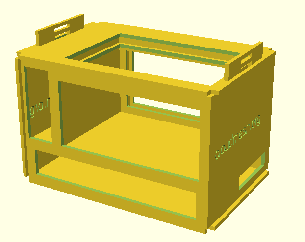{width=50%} | 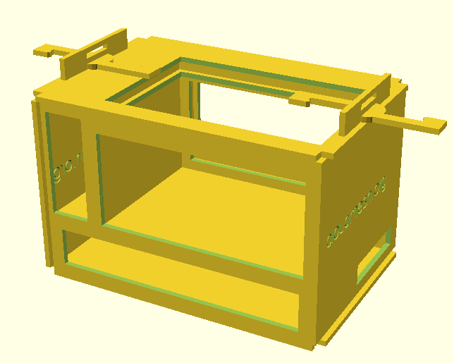{width=50%} |
|  Add H | Add L1 L2  |
| 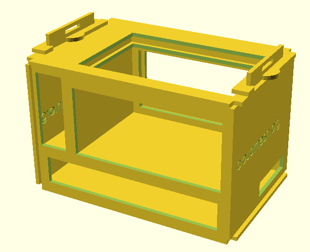{width=50%} |    |
| Twist L1 L2  |   |

## Links

* Other cases are at <https://github.com/cloudmesh-community/book/blob/master/chapters/pi/case.md>
* Website for OpenSCAD http://www.openscad.org/index.html
* Presentation: <https://docs.google.com/presentation/d/1CSdbXzB3QMpkFJ3mvA80TYrvF13VuKiJK-m96QDGw_I>
* Images are included in the file are available at
  <https://github.com/cloudmesh-community/case/blob/master/appendix.md>

## References

