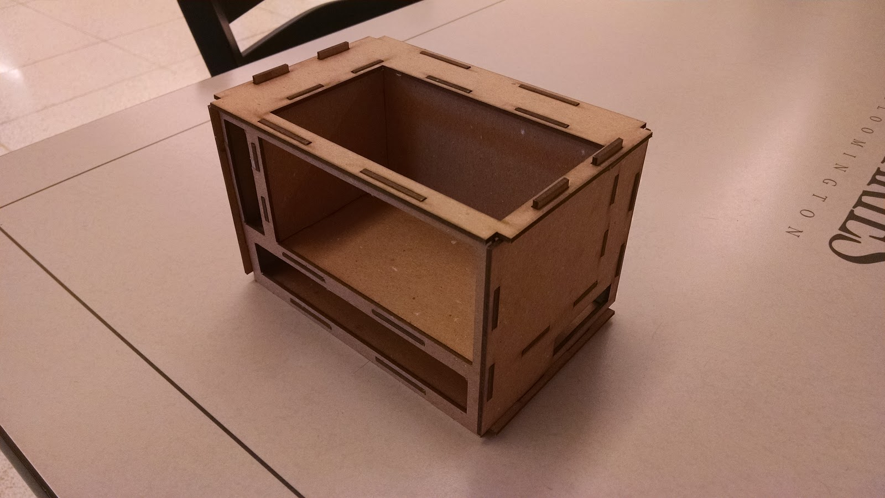

# Raspbery PI 5 node Cluster Case

Eliyah Zayin2, Diego Ansaldo3, Gregor von Laszewski1

* 1Indiana University, laszewski@gmail.com 
* 2The Academy of Science and Entrepreneurship, diegansaldo@gmail.com
* 3The Academy of Science and Entrepreneurship, ???@gmail.com

TODO: mosve designs form 

https://drive.google.com/drive/folders/1D8YjtOAh8FemuruPYPWuV4zYNxszW_wN

to this github, only keep final design here.

## Abstract

* case for cluster
* iu course
* case easy to assmple no screws, glue
* easy replicatable
* open source
* modifiable
* integrated into box product
* (integrated into shelf)

## Introduction

## Requirements

## Design

The list of parts is provided in Table 1.

Table 1: Parts list as copied from <https://github.com/cloudmesh-community/book/blob/master/chapters/pi/case.md>

| Price | Description | URL |
| :- | :------- | :- |
$29.99 | Anker 60W 6-Port USB Wall Charger, PowerPort 6 for iPhone 7 / 6s / Plus, iPad Pro / Air 2 / mini, Galaxy S7 / S6 / Edge / Plus, Note 5 / 4, LG, Nexus, HTC and More | [link](https://www.amazon.com/Anker-6-Port-Charger-PowerPort-iPhone/dp/B00P933OJC/ref=pd\_sim\_107\_70?\_encoding=UTF8\&psc=1\&refRID=B1S6V5G0CTJ9NH5G0CRT) |
$8.90 | Cat 6 Ethernet Cable 1 ft White (6 Pack) - Flat Internet Network Cable - Jadaol Cat 6 Computer Cable short - Cat6 Ethernet Patch Lan Cable With | [link](https://www.amazon.com/Cat-Ethernet-Cable-White-Pack/dp/B01IQWGI0O/ref=sr\_1\_1?s=electronics\&ie=UTF8\&qid=1513699717\&sr=1-1\&keywords=Cat+6+Ethernet+Cable+1+ft+White+\%28+6+Pack+\%29+\%E2\%80\%93+Flat+Internet+Network+Cable+\%E2\%80\%93+Jadaol+Cat+6+Computer+Cable+short+-+Cat6+Ethernet+Patch+Lan+Cable+With\%E2\%80\%A6) |
$19.99 $^{(1)}$ | D-link 8-Port Unmanaged Gigabit Switch (GO-SW-8G) | [link](https://www.amazon.com/D-link-8-Port-Unmanaged-Gigabit-GO-SW-8G/dp/B008PC1MSO) |
$10.49 | SanDisk Ultra 32GB microSDHC UHS-I Card with Adapter, Grey/Red, Standard Packaging (SDSQUNC-032G-GN6MA) | [link](https://www.amazon.com/SanDisk-microSDHC-Standard-Packaging-SDSQUNC-032G-GN6MA/dp/B010Q57T02/ref=sr\_1\_10?s=pc\&rps=1\&ie=UTF8\&qid=1498443283\&sr=1-10\&refinements=p\_85:2470955011,p\_n\_feature\_two\_browse-bin:6518304011,p\_n\_feature\_keywords\_two\_browse-bin:5947557011) |
$8.59 | Short USB Cable, OKRAY 10 Pack Colorful Micro USB 2.0 Charging Data Sync Cable Cord for Samsung, Android Phone and Tablet, Nexus, HTC, Nokia, LG, Sony, Many Digital Cameras-0.66ft (7.87 Inch) | [link](https://www.amazon.com/OKRAY-Colorful-Charging-Samsung-Cameras-0-66ft/dp/B00R5GZJR6/ref=sr\_1\_6?s=pc\&ie=UTF8\&qid=1498447476\&sr=1-6\&keywords=micro+usb+cable+1ft) |
$7.69 | 50 Pcs M2 x 20mm + 5mm Hex Hexagonal Threaded Spacer Support | [link](https://www.amazon.com/20mm-Hexagonal-Threaded-Spacer-Support/dp/B00FH8AB8Q/ref=sr\_1\_9?s=industrial\&ie=UTF8\&qid=1513700337\&sr=1-9\&keywords=hex+spacers+m2+20mm) |
$7.99 | Easycargo 15 pcs Raspberry Pi Heatsink Aluminum + Copper + 3M 8810 thermal conductive adhesive tape for cooling cooler Raspberry Pi 3, Pi 2, Pi Model B+ | [link](https://www.amazon.com/Easycargo-Raspberry-Heatsink-Aluminum-conductive/dp/B07217N5LS/ref=sr\_1\_3?s=industrial\&ie=UTF8\&qid=1513700498\&sr=1-3\&keywords=raspberry+pi+3) |
$34.49 | Raspberry Pi 3 Model B Motherboard (you need at least 3 of them) | [link](https://www.amazon.com/Raspberry-Pi-RASPBERRYPI3-MODB-1GB-Model-Motherboard/dp/B01CD5VC92) |
$59.99  $^{(2)}$ | 1TB drive | [link](http://wdlabs.wd.com/products/wd-pidrive-berryboot-edition/) |
$15.19 | 64GB flash | [link](https://www.wdc.com/products/wdlabs/wd-pidrive-foundation-edition.html\#WD3750LMCW) |
$6.99 | HDMI Cable, Rankie 2-Pack 6FT Latest Standard HDMI 2.0 HDTV Cable - Supports Ethernet, 3D, 4K and Audio Return (Black) - R1108 | [link](https://www.amazon.com/Cable-Rankie-2-Pack-Latest-Standard/dp/B00Z07XQ4A/ref=sr\_1\_6?s=wireless\&ie=UTF8\&qid=1513782649\&sr=1-6\&keywords=hdmi+cable+6ft) |
$12.99 | AUKEY USB C Adapter, USB C to USB 3.0 Adapter Aluminum 2 Pack for Samsung Note 8 S8 S8+, Google Pixel 2 XL, MacBook Pro, Nexus 6P 5X, LG G5 V20 (Gray) | [link](https://www.amazon.com/Cat-Ethernet-Cable-White-Pack/dp/B01IQWGI0O/ref=pd\_sim\_147\_2?\_encoding=UTF8\&psc=1\&refRID=FZZ7E36666EJPDTH7B6A) |
$19.19 | For Raspberry Pi 3 2 TFT LCD Display, kuman 3.5 Inch 480x320 TFT Touch Screen Monitor for Raspberry Pi Model B B+ A+ A Module SPI Interface with Touch Pen SC06 | [link](https://www.amazon.com/Raspberry-Display-kuman-480x320-Interface/dp/B01CNJVG8K/ref=sr\_1\_1?s=electronics\&ie=UTF8\&qid=1513783748\&sr=1-1\&keywords=pi+3+lcd+screen+3.5in) |

(1) items were replaced with similar
(2) item was not available

## Alternatives

* https://www.festi.info/boxes.py/

## Manufacturing Facilities

## Product

* box with stuff in it

**Figure 1:** Prototype 1

## Future work

19 inch rack for 40 nodes via bitscope, <https://www.festi.info/boxes.py/Rack19Box>

shelf for 5 node clusters.

## Refernces

* Other cases are at <https://github.com/cloudmesh-community/book/blob/master/chapters/pi/case.md>

