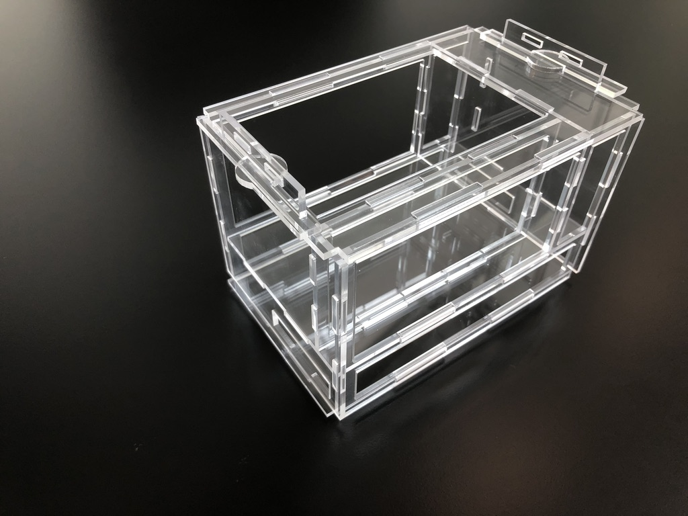
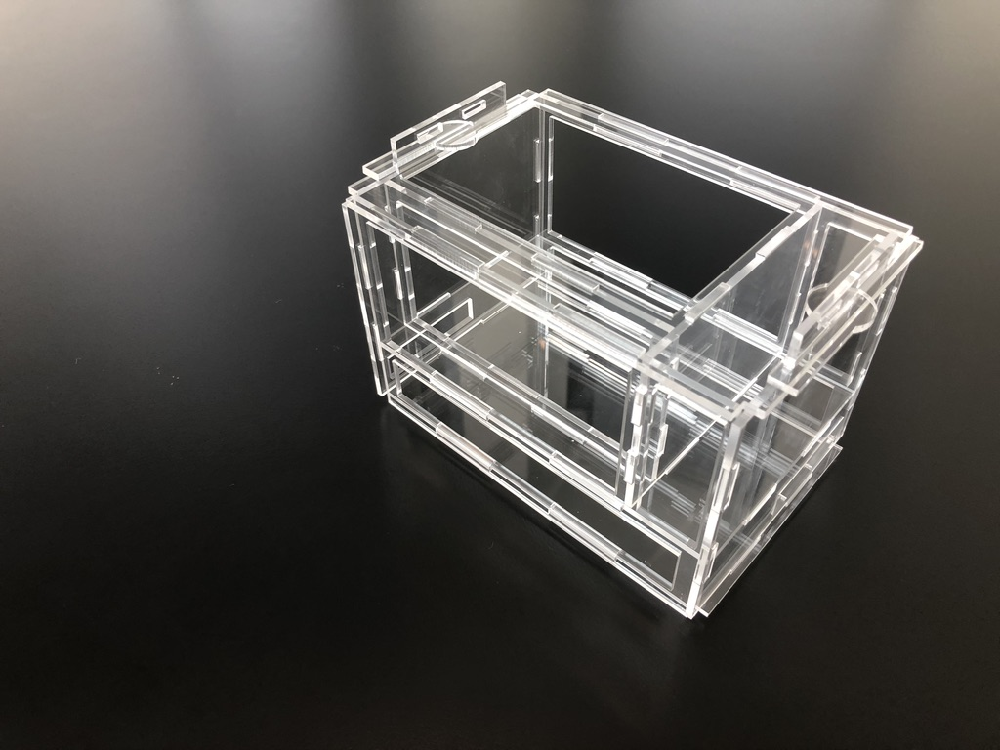
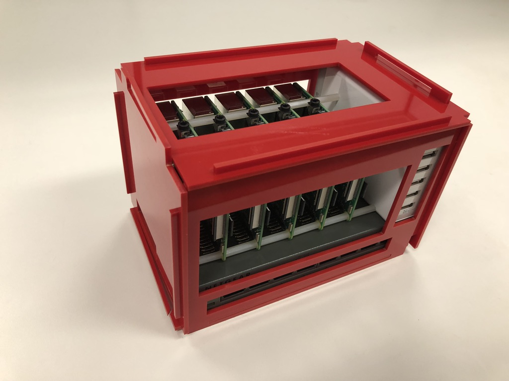
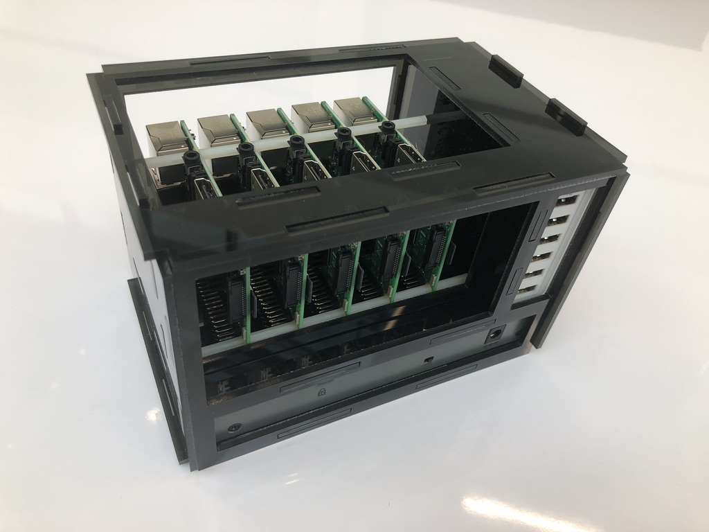
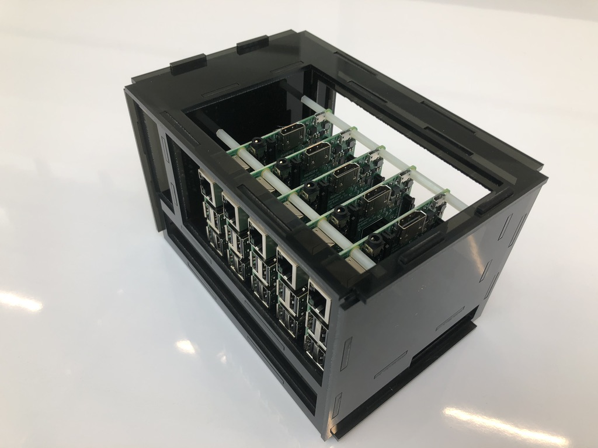
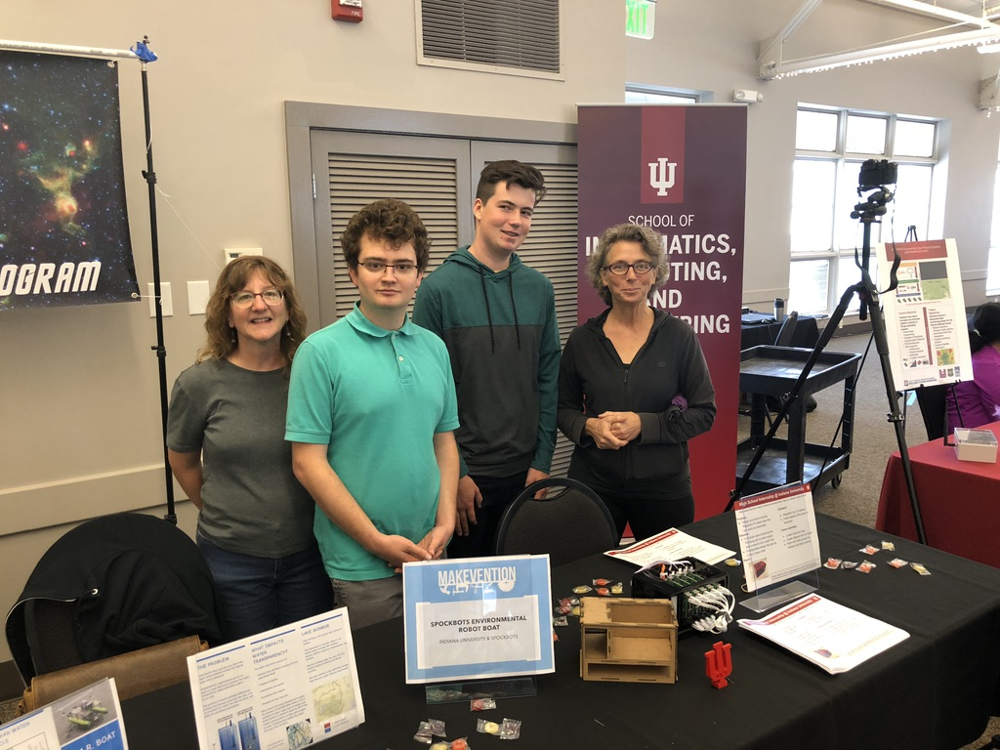

## Appendix

THis appendix contains some image examples

### Transparent Case

{#fig:case5d0 with=50%}

{#fig:case5d1 with=50%}

{#fig:case5d2 with=50%}

{#fig:case5d5 with=50%}

{#fig:case5d6 with=50%}

{#fig:case5d7 with=50%}

### Red Case

{#fig:case7ad with=50%}

{#fig:case7ae with=50%}

{#fig:case7af with=50%}

### Balck Case

{#fig:case7b7 with=50%}

{#fig:case7b8 with=50%} 

{#fig:case7b9 with=50%}

{#fig:case7ba with=50%}

## Exhibit

{#fig:case7cd with=50%}

{#fig:case7ce with=50%}

{#fig:case7d0 with=50%}

## Product Overview

{#fig:p1}

{#fig:p2}

{#fig:p3}

{#fig:p4}

{#fig:p5}

